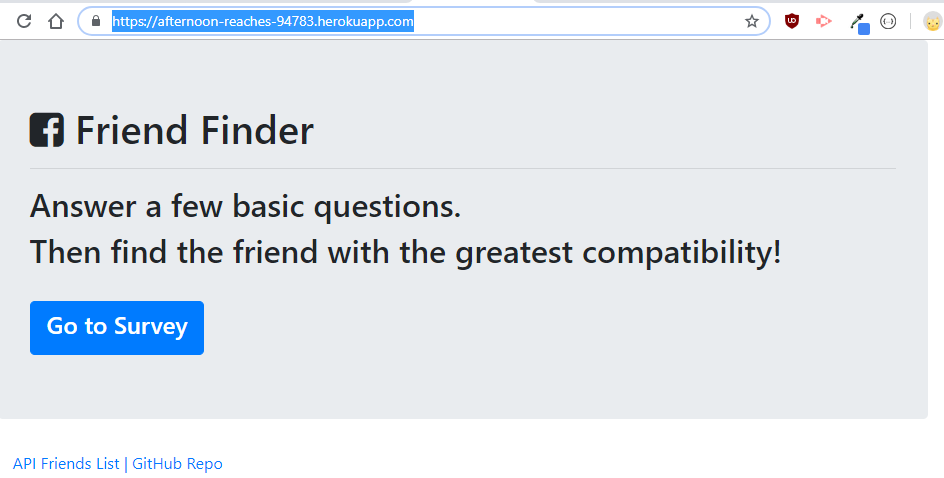

# FriendFinder

## Table of contents

- [General info](#general-info)
- [Technologies](#technologies)
- [Deployment](#Deployment)

## General info

This is a "FriendFinder" application using Express to handle routing.We taking in results from your users' surveys, then compare their answers with those from other users. The app will then display the name and picture of the user with the best overall match.

## Technologies

Project is created with:

- JavaScript
- Node.js
- NPM package
- Heroku

## Deployment

- Clone the repo and npm install
- Portfolio link: https://elvykiung.github.io/
- App Link: https://afternoon-reaches-94783.herokuapp.com/
